# 🎟️ Tickify -  Event Management & Ticket Booking Web Application

Tickify is a full-stack event management and ticket booking web application. It enables organizers to list, manage, and audit event check-ins, provides participants with event discovery, ticket purchasing, and automated email reminders, and empowers administrators to review and approve listings.

---

## ✨ Key Features

- **🔍 Interactive Event Discovery**:
  - Full-text search queries targeting event titles and descriptions.
  - Category-based event filtration (Music, Art, Workshop, Seminar, Conference, Comedy).
  - Modern, responsive event grid and details layouts.

- **⏱️ Locked Seat Reservation System**:
  - Auto-holds seats when checkout begins to prevent overbooking.
  - Automatic expiration and cleanup: Unpaid reservations are released back to the event pool after 10 minutes.

- **💳 Integrated Razorpay Payments**:
  - Secure checkouts processing in INR.
  - Cryptographic payment signature verification on the backend.
  - Background cron-scheduler reconciles expired/interrupted gateway checkouts.

- **🎫 Digital PDF Tickets & Cryptographic QR Codes**:
  - Generates secure digital ticket cards with unique sequence indexes.
  - Cryptographically signed QR codes (using a server-side JSON secret hash) prevent spoofing.
  - PDF Export: Downloader captures crisp ticket cards as PDFs with embedded QR codes.

- **📷 Real-Time Camera QR Check-In Scanner**:
  - Organizer check-in screen equipped with a camera QR code scanning frame.
  - Validates and checks in attendees in real-time, blocking used, cancelled, or invalid credentials.
  - Supports manual key verification fallback.

- **💸 Cancellation & Refund Ledger**:
  - Hassle-free cancellations for users.
  - Automatically files refund ledgers, awaiting admin confirmation.
  - Admin dashboard to process pending payouts.

- **👥 Role-Based Workspaces (RBAC)**:
  - **Participants**: View purchases, access active digital tickets, cancel bookings, and view payments.
  - **Organizers**: Create and edit event listings, upload poster headers, review attendee registers, and perform check-ins.
  - **Administrators**: Approve/reject event requests with remarks, toggle organizer account verifications, and audit refunds.

- **🔔 Automated Notifications & Mail Reminders**:
  - In-app alert feeds tracking booking, refund, and event updates.
  - Automatic email notifications for account OTP verifications and ticket receipts.
  - E-mail reminder cron daemon triggers 12 hours prior to event commencement.

---

## 🏗️ Architecture Diagram

Tickify follows a modern decoupled architecture. The frontend communicates with the backend API via HTTPS requests and uses HttpOnly cookies for session verification.

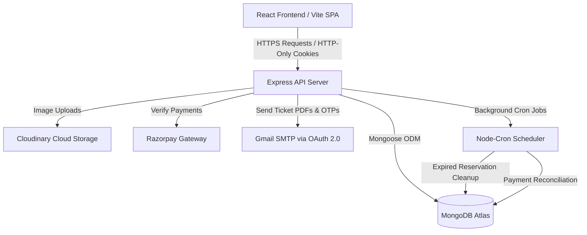

---

## 🛠️ Technology Stack

### Frontend
- **Core Framework**: React 19 (Functional Components, Hooks)
- **Build Tool**: Vite
- **Styling**: Tailwind CSS v4
- **State Management**: Redux Toolkit & React Redux
- **Data Fetching**: RTK Query (RTKQ)
- **Forms & Validation**: React Hook Form with Zod Resolver
- **PDF & QR Code Generation**: `jspdf`, `html-to-image`, `qrcode.react`
- **Scanning**: `html5-qrcode` (HTML5 camera video QR scanner)
- **Charts**: `recharts` (Responsive SVG area/bar charts)
- **Toasts**: `react-hot-toast`

### Backend
- **Runtime Environment**: Node.js
- **Web Framework**: Express.js (v5)
- **Database**: MongoDB (Object modeling via Mongoose v9)
- **Security & Headers**: `helmet`, `hpp` (HTTP Parameter Pollution protection), `bcrypt` (password hashing), `express-rate-limit`
- **Session Auth**: JWT (JSON Web Tokens stored in HTTP-Only Cookies)
- **Uploads Handler**: `multer`
- **Storage**: Cloudinary SDK
- **Mailing**: `nodemailer` (Google OAuth2 transporter)
- **Payments**: `razorpay` Node SDK
- **Task Scheduler**: `node-cron`
- **Validation**: `zod`

---

## 🔐 Environment Variables

Create these files in their respective folders. **Do not share real secrets in public repositories.**

### Backend (`backend/.env`)
```ini
# Server Setup
PORT=5000
FRONTEND_URL=http://localhost:5173

# Database configuration
MONGO_URI=mongodb+srv://<username>:<password>@<cluster>.mongodb.net/<dbname>?retryWrites=true&w=majority
REDIS_URL=redis://default:<password>@<host>:<port>

# JSON Web Token Secret
JWT_SECRET=your_super_secure_jwt_secret_hex_string

# Cloudinary Credentials (for poster uploads)
CLOUDINARY_CLOUD_NAME=your_cloudinary_cloud_name
CLOUDINARY_API_KEY=your_cloudinary_api_key
CLOUDINARY_API_SECRET=your_cloudinary_api_secret

# Google SMTP OAuth 2.0 Credentials (for nodemailer)
GOOGLE_USER=your_gmail_address@gmail.com
GOOGLE_CLIENT_ID=your_google_client_id.apps.googleusercontent.com
GOOGLE_CLIENT_SECRET=your_google_client_secret
GOOGLE_REFRESH_TOKEN=your_google_oauth2_refresh_token

# Razorpay Gateways Credentials
RAZORPAY_KEY_ID=rzp_test_your_razorpay_key_id
RAZORPAY_KEY_SECRET=your_razorpay_key_secret

# Ticket Cryptographic QR Secret
TICKET_QR_SECRET=your_cryptographic_ticket_verification_secret_hex
```

### Frontend (`frontend/.env`)
```ini
VITE_API_URL=http://localhost:5000
```

---

## 📨 Google OAuth 2.0 Mail Configuration

Tickify sends registration verification OTPs and event tickets via email. This requires Google OAuth 2.0 credentials to configure Nodemailer securely with Gmail.

### Step-by-Step Google Console Setup
1. **Create a Google Cloud Project**:
   - Go to [Google Cloud Console](https://console.cloud.google.com/).
   - Click **New Project**, name it `Tickify Mail`, and click **Create**.
2. **Configure Consent Screen**:
   - Navigate to **APIs & Services** > **OAuth consent screen**.
   - Select **External** and click **Create**.
   - Provide the app details: App name (`Tickify`), User support email, and Developer contact information. Click **Save and Continue**.
   - Skip Scopes for now. Under **Test Users**, add your Gmail account (`your_gmail_address@gmail.com`). Only listed test users can authenticate in development mode. Save and finish.
3. **Generate OAuth Credentials**:
   - Navigate to **APIs & Services** > **Credentials**.
   - Click **Create Credentials** > **OAuth client ID**.
   - Set Application Type to **Web application**.
   - Under **Authorized redirect URIs**, add: `https://developers.google.com/oauthplayground`
   - Click **Create** and copy your **Client ID** and **Client Secret**.
4. **Obtain the Refresh Token**:
   - Go to [Google OAuth 2.0 Playground](https://developers.google.com/oauthplayground).
   - Click the gear icon ⚙️ on the top-right corner.
   - Check **Use your own OAuth credentials** and enter your **OAuth Client ID** and **OAuth Client Secret**.
   - Under **Step 1: Select & authorize APIs**, enter `https://mail.google.com/` in the text box and click **Authorize APIs**.
   - Log in using your test Gmail account and click **Allow/Grant Permissions**.
   - Under **Step 2: Exchange authorization code for tokens**, click **Exchange authorization code for tokens**.
   - Copy the generated **Refresh Token** from the input box. Add it to `backend/.env` under `GOOGLE_REFRESH_TOKEN`.

---

## 🗄️ Database Schema (MongoDB / Mongoose)

Tickify maps relational business logic over MongoDB collections using Mongoose.

### 1. User Schema (`user`)
Stores authentication profiles, roles, and verification states.
| Field | Type | Attributes | Description |
| :--- | :--- | :--- | :--- |
| `_id` | ObjectId | Auto-generated | Unique document identifier |
| `fullName` | String | Min 3, Max 30, Required | User's billing and ticket name |
| `email` | String | Unique, Lowercase, Regex, Required | Account email address |
| `password` | String | Min 5, Selected: `false` | Hashed password |
| `profilePhoto` | String | Optional | Cloudinary photo URL |
| `profilePhotoPublicId` | String | Optional | Cloudinary reference ID |
| `role` | String | Enum: `["user", "organizer", "admin"]` | Access levels (default: `user`) |
| `isEmailVerified` | Boolean | Default: `false` | OTP status checker |
| `createdAt` / `updatedAt` | Date | Timestamps | Auto-managed timestamps |

### 2. Event Schema (`event`)
Houses event metadata, venues, capacity, pricing, and admin approval states.
| Field | Type | Attributes | Description |
| :--- | :--- | :--- | :--- |
| `title` | String | Max 120, Required, Indexed | Text indexed title |
| `description` | String | Max 500, Required | Text description |
| `venue` | Object | `{ name, address, city, state, country }` | Geolocation metadata |
| `category` | String | Enum: `["Music", "Art", "Workshop", ...]` | Genre classifications |
| `startDate` / `endDate` | Date | Required | Scheduled timelines |
| `poster` | String | Required | Cloudinary image link |
| `organizer` | ObjectId | Ref: `user`, Required | Reference to the organizer |
| `totalSeats` | Number | Min 1, Required | Total ticket availability |
| `availableSeats` | Number | Min 0 | Remaining seats |
| `ticketPrice` | Number | Min 0, Required | Entry cost (0 represents free entry) |
| `status` | String | Enum: `["pending", "approved", ...]` | Moderation state (default: `pending`) |
| `reviewRemark` | String | Optional | Rejection or approval notes |

### 3. Booking Schema (`booking`)
Represents tickets reservation states. Unpaid bookings expire after a threshold.
| Field | Type | Attributes | Description |
| :--- | :--- | :--- | :--- |
| `user` | ObjectId | Ref: `user`, Required | The buyer |
| `event` | ObjectId | Ref: `event`, Required | The target event |
| `quantity` | Number | Min 1, Required | Number of seats reserved |
| `totalAmount` | Number | Required | Cost sum |
| `bookingStatus` | String | Enum: `["pending", "confirmed", "cancelled"]` | Current status |
| `paymentStatus` | String | Enum: `["not_started", "initiated", "success", "failed", "refunded"]` | Gate payment status |
| `reservationExpiresAt` | Date | Optional | Auto-expiry threshold (locked seats) |

### 4. Ticket Schema (`ticket`)
Attendee voucher representation containing a unique code and verification check-in status.
| Field | Type | Attributes | Description |
| :--- | :--- | :--- | :--- |
| `booking` | ObjectId | Ref: `booking`, Required | Parent invoice booking |
| `event` | ObjectId | Ref: `event`, Required | Event reference |
| `user` | ObjectId | Ref: `user`, Required | Ticket owner |
| `ticketNumber` | String | Unique, Required | Human-readable voucher code |
| `ticketSequence` | Number | Min 1, Required | Ticket index in quantity |
| `ticketStatus` | String | Enum: `["active", "used", "cancelled"]` | Check-in validity |
| `checkedInAt` | Date | Default: `null` | Timestamps of entry check-in |

### 5. Payment Schema (`payment`)
Stores completed transaction logs from Razorpay.
| Field | Type | Attributes | Description |
| :--- | :--- | :--- | :--- |
| `booking` | ObjectId | Ref: `booking`, Required, Unique | Associated invoice booking |
| `user` | ObjectId | Ref: `user`, Required | Buyer reference |
| `paymentGateway` | String | Enum: `["stripe", "razorpay"]` | Gateway vendor used |
| `gatewayOrderId` | String | Unique | Razorpay Order ID |
| `gatewayPaymentId` | String | Unique | Razorpay Payment ID |
| `amount` | Number | Required | Amount captured in INR |
| `paymentStatus` | String | Enum: `["pending", "success", "failed", "refunded"]` | State |
| `fee` / `tax` | Number | Optional | Transaction expenses |

### 6. Refund Schema (`refund`)
Ledger tracks for cancellations and transaction paybacks.
| Field | Type | Attributes | Description |
| :--- | :--- | :--- | :--- |
| `booking` | ObjectId | Ref: `booking`, Required | Target booking cancelled |
| `user` | ObjectId | Ref: `user`, Required | Customer reference |
| `payment` | ObjectId | Ref: `payment`, Required | Original transaction payment |
| `amount` | Number | Required | Returned payout |
| `refundStatus` | String | Enum: `["pending", "failed", "refunded"]` | ledger status |
| `reason` | String | Optional | Reason for cancellation |

---

## 🔌 API Documentation

All routes prefix: `/api`

### Auth & User (`/auth`)
| Method | Endpoint | Auth | Request Body | Description |
| :--- | :--- | :--- | :--- | :--- |
| `POST` | `/signup` | Guest | `{ fullName, email, password, role }` | Registers user (sends verification OTP) |
| `POST` | `/verify-otp` | Guest | `{ email, otp }` | Verifies email and activates account |
| `POST` | `/resend-verification-otp` | Guest | `{ email }` | Resends verification code |
| `POST` | `/forgot-password` | Guest | `{ email }` | Requests password reset OTP |
| `POST` | `/verify-reset-otp` | Guest | `{ email, otp }` | Validates recovery OTP |
| `POST` | `/reset-password` | Guest | `{ email, password, confirmPassword }` | Overwrites recovery password |
| `POST` | `/login` | Guest | `{ email, password }` | Authenticates user (sets JWT Cookie) |
| `GET` | `/check-auth` | User | *None* | Restores sessions and returns user profile |
| `POST` | `/logout` | User | *None* | Clears browser session token |
| `GET` | `/admins` | Public | *None* | Retrieves administrative emails |
| `GET` | `/admin/organizers` | Admin | *None* | Lists organizer profiles and stats |
| `PATCH` | `/admin/organizers/:organizerId/toggle-verify` | Admin | *None* | Verifies organizer account credentials |
| `DELETE` | `/admin/organizers/:organizerId` | Admin | *None* | Deletes organizer accounts |

### Events (`/events`)
| Method | Endpoint | Auth | Request Body | Description |
| :--- | :--- | :--- | :--- | :--- |
| `GET` | `/` | Public | *Query Parameters* | Searches and filters approved events |
| `GET` | `/:id` | Public | *None* | Retrieves details for an approved event |
| `POST` | `/organizer/create` | Organizer | Multipart/FormData (`title`, `poster` file, etc.) | Submits a new event draft for admin review |
| `GET` | `/organizer/events` | Organizer | *Query Parameters* | Lists events drafted/owned by the organizer |
| `GET` | `/organizer/events/:id` | Organizer | *None* | Retrieves details for the organizer's event |
| `PATCH` | `/organizer/events/:id` | Organizer | Multipart/FormData | Updates an event draft (if not approved yet) |
| `DELETE` | `/organizer/events/:id` | Organizer | *None* | Deletes the organizer's event listing |
| `GET` | `/admin/events` | Admin | *Query Parameters* | Lists all events for moderation reviews |
| `GET` | `/admin/events/:id` | Admin | *None* | Audits a specific event draft |
| `PATCH` | `/admin/approve/:id` | Admin | `{ reviewRemark }` | Approves an event and sets status to active |
| `PATCH` | `/admin/reject/:id` | Admin | `{ reviewRemark }` | Rejects an event listing |

### Bookings (`/bookings`)
| Method | Endpoint | Auth | Request Body | Description |
| :--- | :--- | :--- | :--- | :--- |
| `POST` | `/` | Participant | `{ eventId, quantity }` | reserves seats (starts expiry countdown) |
| `GET` | `/my-bookings` | Participant | *None* | Lists active bookings and histories |
| `GET` | `/:bookingId` | Participant | *None* | Gets detailed invoice details for checkouts |
| `PATCH` | `/:bookingId/cancel` | Participant | *None* | Cancels seat reservation and triggers refund |
| `GET` | `/event/:eventId/registrations` | Organizer | *None* | Renders attendee rosters for organizers |

### Payments (`/payments`)
| Method | Endpoint | Auth | Request Body | Description |
| :--- | :--- | :--- | :--- | :--- |
| `GET` | `/my-payments` | Participant | *None* | Lists transaction ledger entries |
| `POST` | `/booking/:bookingId/initiate` | Participant | *None* | Creates a Razorpay Order ID |
| `POST` | `/verify` | Participant | `{ razorpayOrderId, razorpayPaymentId, ... }` | Cryptographically verifies transaction |

### Tickets (`/tickets`)
| Method | Endpoint | Auth | Request Body | Description |
| :--- | :--- | :--- | :--- | :--- |
| `GET` | `/my-tickets` | Participant | *None* | Lists purchased ticket cards |
| `GET` | `/:ticketId` | Participant | *None* | Gets ticket details & loads QR code |
| `GET` | `/:ticketId/qr` | Participant | *None* | Generates signed cryptographic payload for QR |
| `GET` | `/events/:eventId/tickets` | Organizer | *None* | Lists attendee check-in stats |
| `POST` | `/events/:eventId/check-in` | Organizer | `{ qrPayload }` | Validates ticket QR entry signature |

### Refunds (`/refunds`)
| Method | Endpoint | Auth | Request Body | Description |
| :--- | :--- | :--- | :--- | :--- |
| `GET` | `/my-refunds` | Participant | *None* | Lists participant refunds |
| `GET` | `/admin/all-refunds` | Admin | *None* | Audits system-wide refunds |
| `GET` | `/:refundId` | User | *None* | Retrieves ledger details of a refund |
| `PATCH` | `/:refundId/process` | Admin | *None* | Completes refund payback payout |

### Notifications (`/notifications`)
| Method | Endpoint | Auth | Request Body | Description |
| :--- | :--- | :--- | :--- | :--- |
| `GET` | `/` | User | *None* | Retrieves user notifications |
| `GET` | `/unread-count` | User | *None* | Gets count of unread notifications |
| `PATCH` | `/read-all` | User | *None* | Marks all notifications as read |
| `PATCH` | `/:notificationId/read` | User | *None* | Marks a specific notification as read |
| `DELETE` | `/:notificationId` | User | *None* | Deletes a notification |

---

## 🚀 Installation & Local Setup

### Prerequisites
- Node.js installed (v18+ recommended)
- MongoDB account (local MongoDB or Atlas URI string)
- Redis Server (local or hosted DB instance)

### 1. Clone & Install Dependencies
```bash
git clone https://github.com/your-username/Tickify.git
cd Tickify

# Install backend dependencies
cd backend
npm install

# Install frontend dependencies
cd ../frontend
npm install
```

### 2. Configure Environment Files
- Add a `.env` file to the `/backend` folder using the [Backend Env template](#backend-backendenv).
- Add a `.env` file to the `/frontend` folder using the [Frontend Env template](#frontend-frontendenv).

### 3. Start Development Services
Ensure your local or cloud MongoDB and Redis instances are running.

```bash
# In backend directory
npm run dev

# In frontend directory
npm run dev
```

Visit the application at `http://localhost:5173`.

---

## 🌍 Production Deployment

### Backend Deployment on Render

1. Go to [Render Console](https://dashboard.render.com/) and create a **Web Service**.
2. Connect your Git repository.
3. Configure settings:
   - **Environment**: `Node`
   - **Build Command**: `npm install` (within the `backend` subdirectory or set the Root Directory to `backend`)
   - **Start Command**: `npm start`
4. Add all required secrets from `backend/.env` under **Environment Variables** in Render settings.
5. Set `FRONTEND_URL` to your production frontend domain (e.g., `https://tickify.vercel.app`).
6. Set the `PORT` env to `10000` (Render binds this dynamically, but adding it helps verify).

### Frontend Deployment on Vercel

1. Go to [Vercel Dashboard](https://vercel.com/) and click **Add New Project**.
2. Connect your Git repository.
3. Configure build settings:
   - **Root Directory**: `frontend`
   - **Framework Preset**: `Vite`
   - **Build Command**: `npm run build`
   - **Output Directory**: `dist`
4. Add Environment Variable:
   - `VITE_API_URL`: Your deployed Render Web Service URL (e.g., `https://tickify-api.onrender.com`).
5. Click **Deploy**. Vercel will build and serve your SPA.

---

## 📸 Screenshots

*Include visual layouts of the Tickify portal workflows here.*

| Event Landing Page | Browse Events |
| :---: | :---: |
| 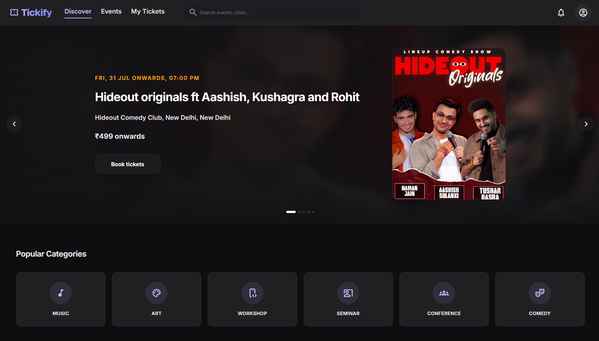 | 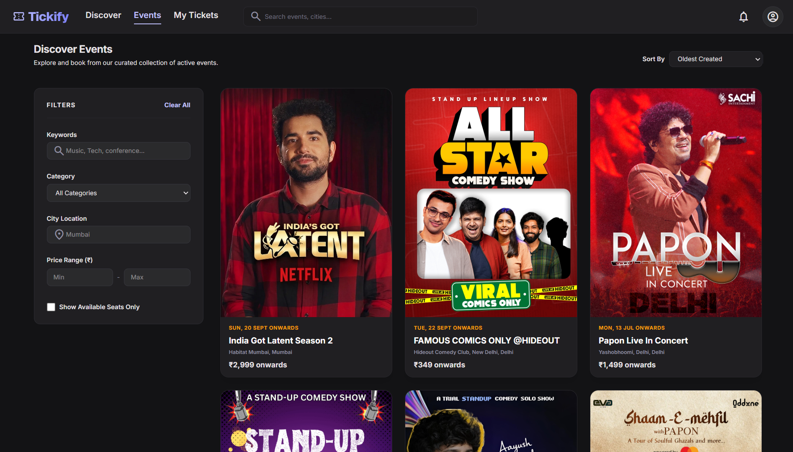 |

| Checkout | Digital Ticket |
| :---: | :---: |
| 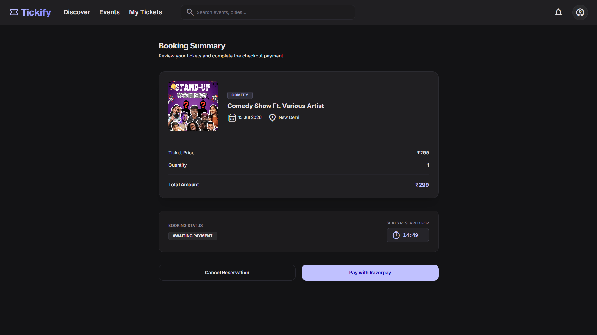 | 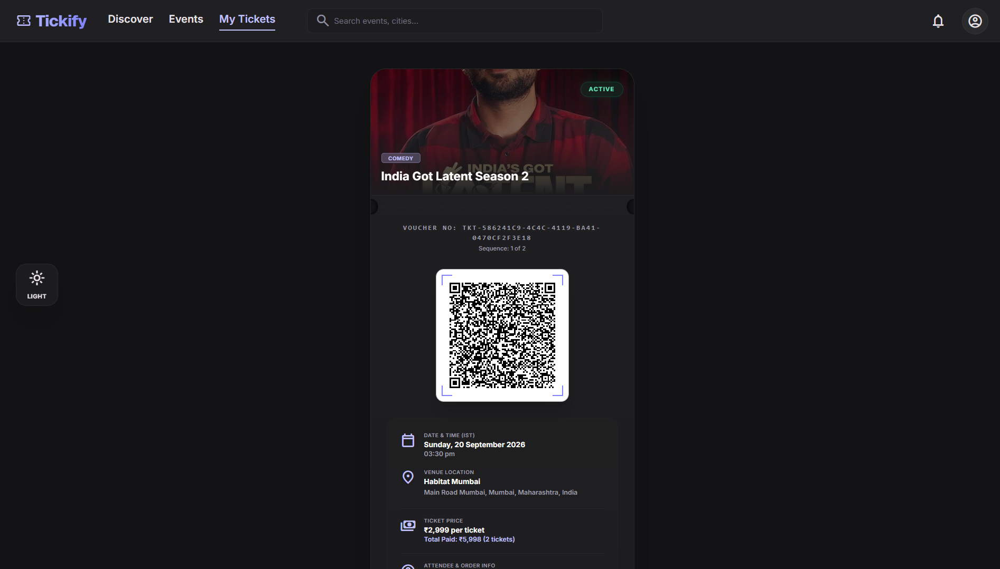 |

| User Dashboard | Organizer Dashboard |
| :---: | :---: |
| 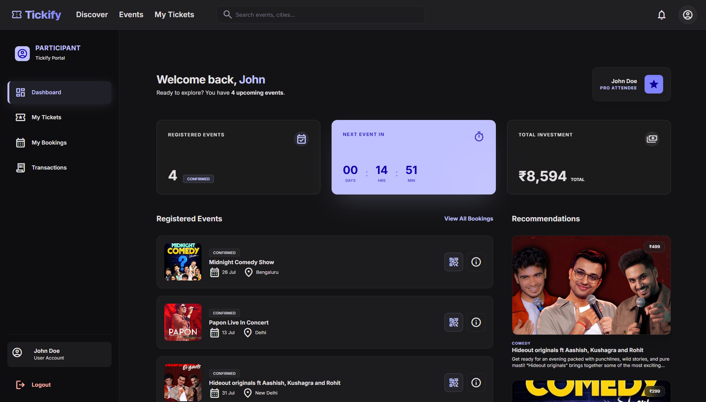 | 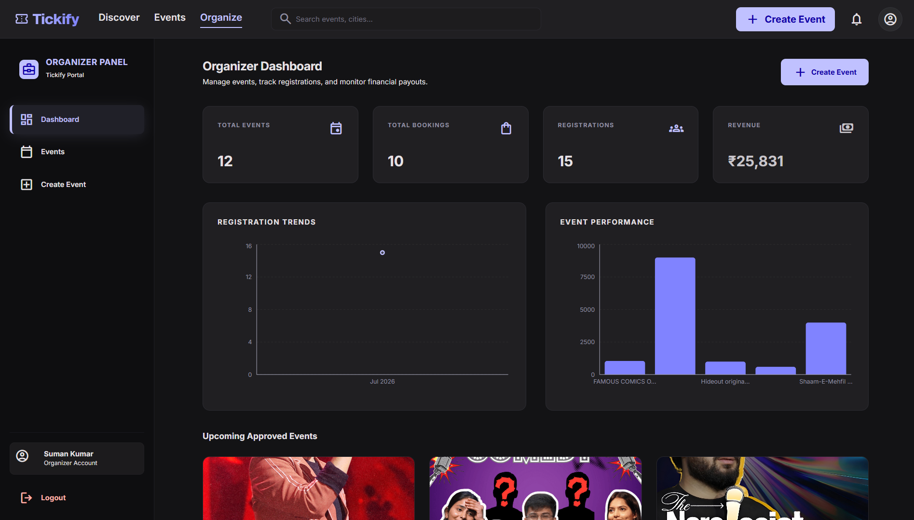 |

| Admin Dashboard | Event Checkin |
| :---: | :---: |
| 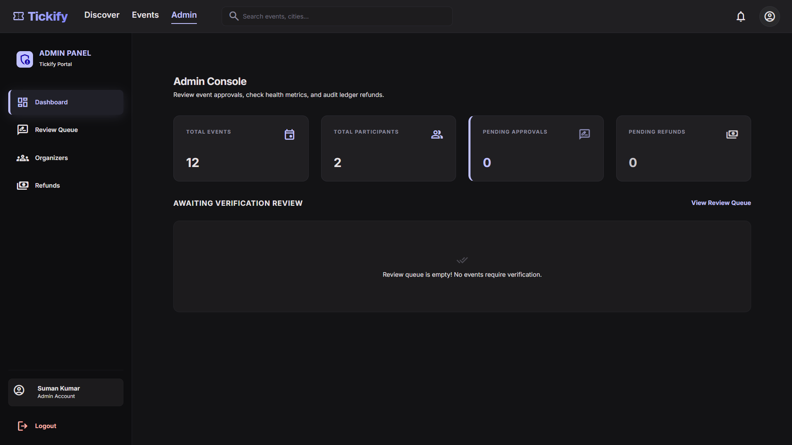 | 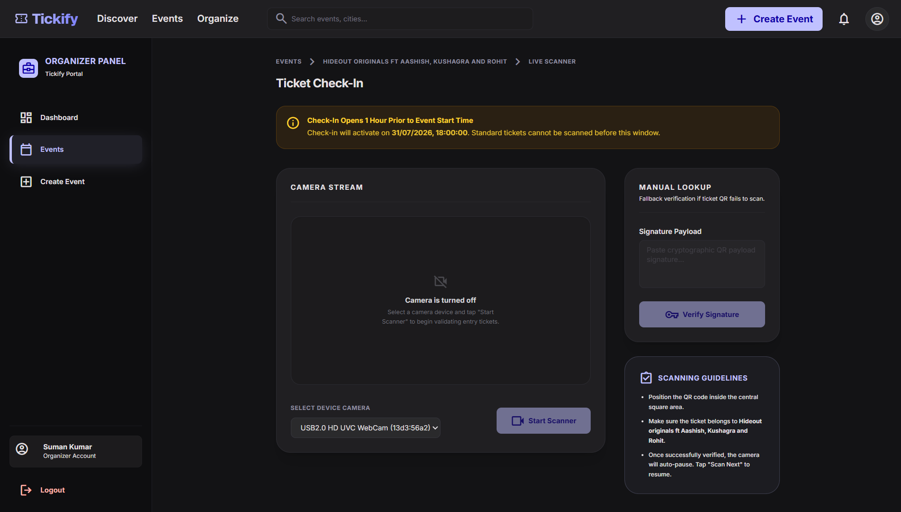 |

| Admin Event Approval | Create Event |
| :---: | :---: |
| 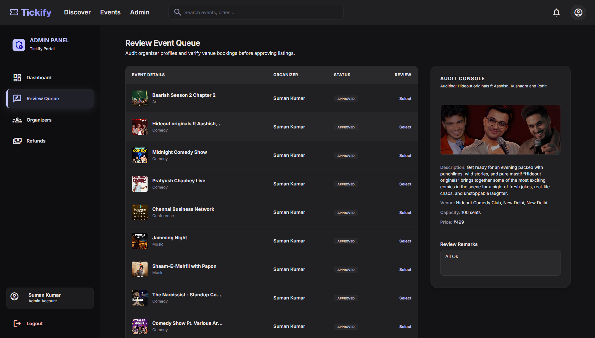 | 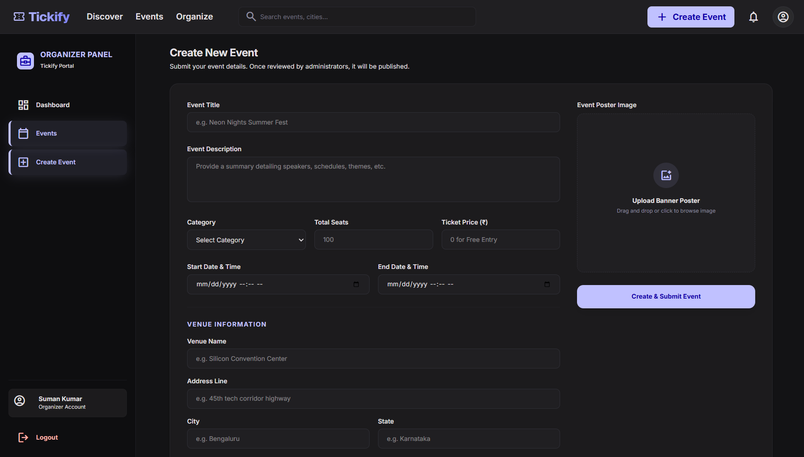 |

| Admin Refund | Organizer's Event |
| :---: | :---: |
| 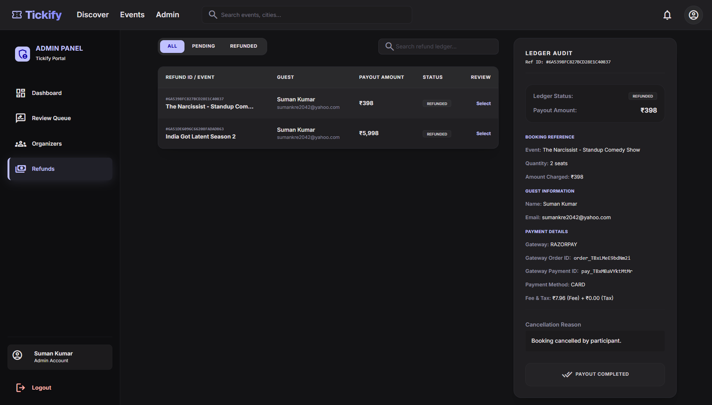 | 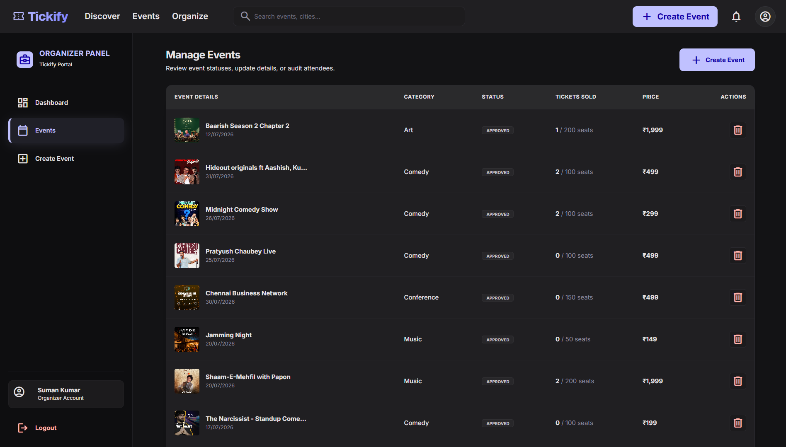 |

| Event Details | Tickets Collection |
| :---: | :---: |
| 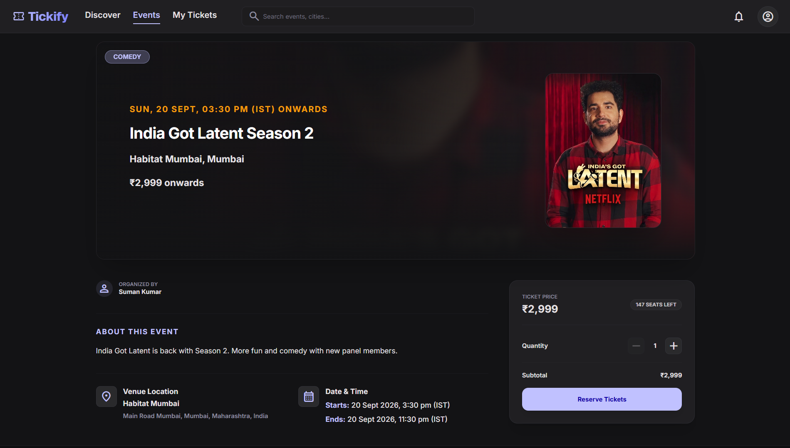 | 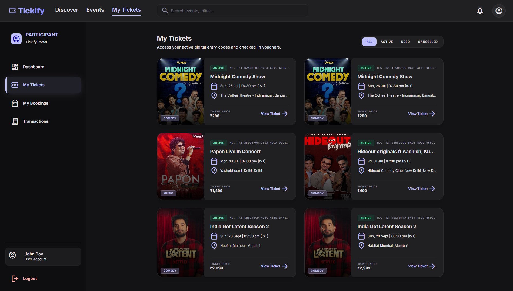 |


## 👨‍💻 Author

Suman Kumar

GitHub: https://github.com/SumanKumar-git
